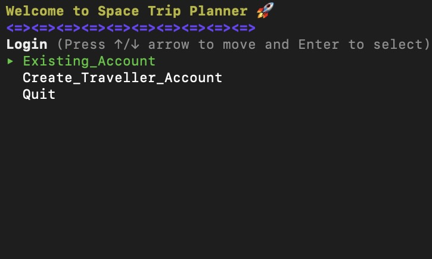
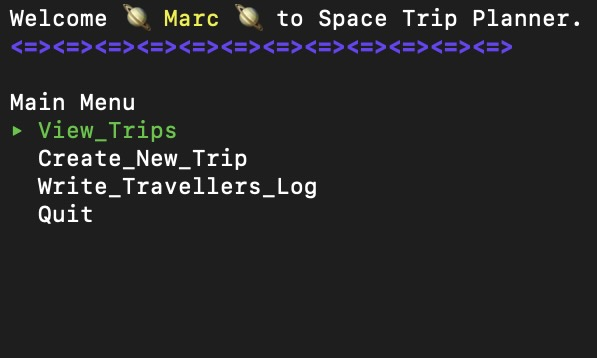
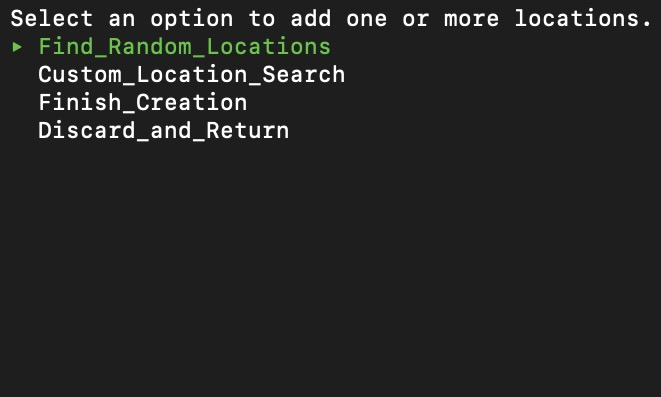
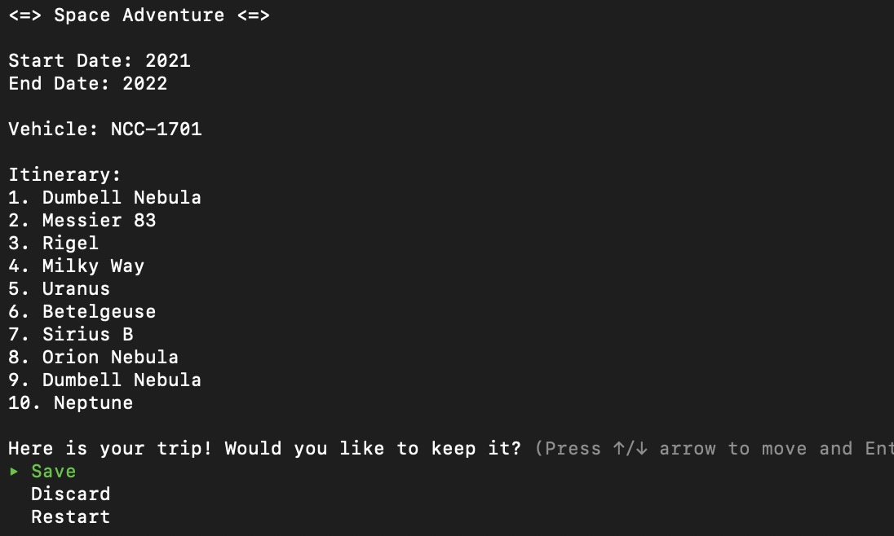
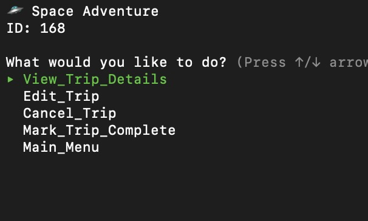
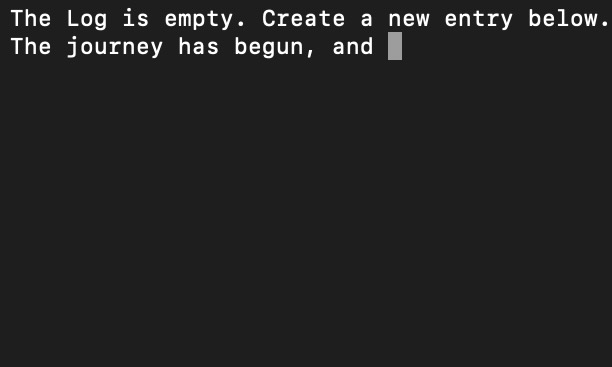

### Interstellar Traveller

__/\\\\\\\\\\\_____________________________________________________________________________________________________/\\\\\\_____/\\\\\\_________________________________        
 _\/////\\\///_____________________________________________________________________________________________________\////\\\____\////\\\_________________________________       
  _____\/\\\_______________________/\\\____________________________________________________/\\\________________________\/\\\_______\/\\\_________________________________      
   _____\/\\\______/\\/\\\\\\____/\\\\\\\\\\\_____/\\\\\\\\___/\\/\\\\\\\___/\\\\\\\\\\__/\\\\\\\\\\\_____/\\\\\\\\_____\/\\\_______\/\\\_____/\\\\\\\\\_____/\\/\\\\\\\__     
    _____\/\\\_____\/\\\////\\\__\////\\\////____/\\\/////\\\_\/\\\/////\\\_\/\\\//////__\////\\\////____/\\\/////\\\____\/\\\_______\/\\\____\////////\\\___\/\\\/////\\\_    
     _____\/\\\_____\/\\\__\//\\\____\/\\\_______/\\\\\\\\\\\__\/\\\___\///__\/\\\\\\\\\\____\/\\\_______/\\\\\\\\\\\_____\/\\\_______\/\\\______/\\\\\\\\\\__\/\\\___\///__   
      _____\/\\\_____\/\\\___\/\\\____\/\\\_/\\__\//\\///////___\/\\\_________\////////\\\____\/\\\_/\\__\//\\///////______\/\\\_______\/\\\_____/\\\/////\\\__\/\\\_________  
       __/\\\\\\\\\\\_\/\\\___\/\\\____\//\\\\\____\//\\\\\\\\\\_\/\\\__________/\\\\\\\\\\____\//\\\\\____\//\\\\\\\\\\__/\\\\\\\\\__/\\\\\\\\\_\//\\\\\\\\/\\_\/\\\_________ 
        _\///////////__\///____\///______\/////______\//////////__\///__________\//////////______\/////______\//////////__\/////////__\/////////___\////////\//__\///__________
__/\\\\\\\\\\\\\\\____________________________________________________________/\\\\\\_____/\\\\\\_________________________________                                             
 _\///////\\\/////____________________________________________________________\////\\\____\////\\\_________________________________                                            
  _______\/\\\____________________________________________________________________\/\\\_______\/\\\_________________________________                                           
   _______\/\\\________/\\/\\\\\\\___/\\\\\\\\\_____/\\\____/\\\_____/\\\\\\\\_____\/\\\_______\/\\\________/\\\\\\\\___/\\/\\\\\\\__                                          
    _______\/\\\_______\/\\\/////\\\_\////////\\\___\//\\\__/\\\____/\\\/////\\\____\/\\\_______\/\\\______/\\\/////\\\_\/\\\/////\\\_                                         
     _______\/\\\_______\/\\\___\///____/\\\\\\\\\\___\//\\\/\\\____/\\\\\\\\\\\_____\/\\\_______\/\\\_____/\\\\\\\\\\\__\/\\\___\///__                                        
      _______\/\\\_______\/\\\__________/\\\/////\\\____\//\\\\\____\//\\///////______\/\\\_______\/\\\____\//\\///////___\/\\\_________                                       
       _______\/\\\_______\/\\\_________\//\\\\\\\\/\\____\//\\\______\//\\\\\\\\\\__/\\\\\\\\\__/\\\\\\\\\__\//\\\\\\\\\\_\/\\\_________                                      
        _______\///________\///___________\////////\//______\///________\//////////__\/////////__\/////////____\//////////__\///__________                                      

## Introduction
Welcome to Interstellar Traveller! 

## SETUP

1. Head to this link https://github.com/marcferraro/Space-Trip-Planner and clone to your text editor project folder.
2. Open your text editor then open all files in the clones folder.
3. Run 'bundle install' 
4. Run 'rake db:migrate'
5. Run 'rake db:seed'
6. Run 'ruby bin/run.rb'

## Program Features
Create accounts, plan trips and write journals.

# Create Account
1. In main menu select Create_Traveller_Account and enter name and age.
2. Keep track of your id number for future logins.
3. If you have any existing accounts, select Existing_Account and enter id.

# Plan Trips
1. To create a new trip, select Create_New_Trip and enter start date and end date.

2. To add loctions to your trip, select either Find_Random_Locations or Custom_Location_Search.
3. In Find_Random_Locations you will given three random locations to choose from. Enter the id of the location you would like to add to your itinerary.

4. In Custom_Location_Search choose the options that best describe the location you would like to travel to. Then enter the id of location to add to your itinerary.
5. When finished, select Finish_Creation.
6. Enter the name of your trip and vehicle you will be taking.
7. Select save to create your trip, discard to head back to main menu or restart to begin this process again.

8. To view trip details select View_Trips in Main Menu.

# Log Entry
1. To create a new log entry select Write_Travellers_Log then select New_Entry
2. Enter a trip id for the log you would like to enter.
3. Write your new entry, then hit enter when finished.

4. Select New_Entry to create another or Main_Menu to head back.

